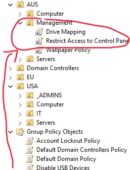

# Restrict Access to Control Panel Using Group Policy in Active Directory

In this tutorial, we configure a Group Policy Object (GPO) in an Active Directory environment to restrict domain users from accessing the Control Panel and Windows PC Settings. This lab uses VMware Workstation with one Domain Controller and two Windows client virtual machines to demonstrate how Group Policy can centrally enforce user restrictions across multiple domain-joined computers.

## Environments and Technologies Used

* VMware Workstation
* Windows Server
* Active Directory Domain Services (AD DS)
* Group Policy Management
* Group Policy Objects (GPOs)
* Windows Command Line

## Operating Systems Used

* Windows Server
* Windows 10

## Actions and Observations

### 1. Create the Restrict Access to Control Panel GPO

* Open **Group Policy Management** on the Domain Controller.
* Right-click the domain and select:
  **Create a GPO in this domain, and Link it here...**
* Name the GPO:
  **Restrict Access to Control Panel**
* Right-click the newly created GPO and select:
  **Edit**

  

  

  

 

### 2. Configure the Control Panel Restriction

* Navigate to:

  **User Configuration**
  → **Policies**
  → **Administrative Templates**
  → **Control Panel**

* Locate:
  **Prohibit access to Control Panel and PC settings**

* Right-click the policy and select:
  **Properties**

* Select:
  **Enabled**

* Click:
  **Apply**

* Click:
  **OK**

This policy prevents users from opening the Control Panel and accessing Windows PC Settings.  

  

  

  

### 3. Apply the GPO to the Appropriate OU

* Return to **Group Policy Management**.
* Navigate to **Group Policy Objects**.
* Locate the **Restrict Access to Control Panel** GPO.
* Link the GPO to the Organizational Unit (OU) containing the users who should receive the restriction.
* For testing purposes, the GPO can be applied to an OU containing the lab users.

Because the restriction is configured under **User Configuration**, the policy is intended to apply to the targeted user accounts.  

  

### 4. Force a Group Policy Update

* Group Policy may take some time to automatically apply.
* To immediately request a Group Policy refresh, open **Command Prompt** on the client VM and run:

```cmd
gpupdate /force
```

  

* This forces the client to retrieve and process the latest applicable Group Policy settings.

### 5. Verify the Control Panel Restriction

* Log in to the client VM using a domain user located within the targeted OU.
* Open the **Start Menu** and attempt to access:
  **Control Panel**
* Attempt to access:
  **Windows PC Settings**

The user should receive a message indicating that the operation has been restricted by the system administrator.

* Test the GPO on multiple domain-joined client VMs within the applicable OU to verify that the policy is being centrally enforced.

## Results

The **Restrict Access to Control Panel** Group Policy Object successfully prevented targeted domain users from accessing the Control Panel and Windows PC Settings. This demonstrates how Active Directory and Group Policy can be used to centrally enforce user restrictions across multiple domain-joined workstations without manually configuring each computer.
